# Load Tests Examples with Camel, Kafka and Opentelemetry

Load tests are an essential practice in software development as they allow evaluating the performance and capacity of a system under high-demand conditions. This type of testing simulates situations where many users are interacting simultaneously with the system, performing various operations such as sending requests, processing data, and accessing resources.

The goal of load testing is to identify potential bottlenecks and limitations of the system, ensuring that it can handle the expected load and maintain acceptable performance. During the test, important metrics are collected and analyzed, including response time, throughput, resource utilization, and scalability.

There are various approaches to conducting load tests. One of them is to use specialized tools that allow simulating a large number of concurrent users, generating realistic workloads, and monitoring the system's performance. These tools provide detailed metrics and reports that help identify potential issues.

Furthermore, load tests can be complemented by techniques such as horizontal scaling, where the system is distributed across multiple servers to increase its processing capacity. This allows evaluating how the system behaves when horizontally scaled, handling higher loads and distributing the processing among different nodes.

If you're looking for a simple and quick solution to test Kafka performance, Kafka Perf Test with the CLI can be a viable option. This tool allows simulating production-level production and consumption loads on a Kafka cluster, with customized configurations to adjust message volume, production rate, message size, among other parameters. It is suitable if you need to perform quick tests and do not require complex integration with other tools or APIs.

On the other hand, if you're seeking a more comprehensive and flexible approach, developing an API for production and an application for consumption, combined with the use of a load testing tool like K6 or JMeter, can offer more possibilities. This approach allows creating more realistic test scenarios involving interactions with other parts of the system, data manipulation, specific validations, among other aspects. K6 is a popular tool for load testing and can be easily integrated into your development and CI/CD workflow.

This approach allows simulating the production and consumption behavior of data in an environment closer to the real-world usage scenario. You can create custom test cases, including specific interactions with other parts of the system, data manipulation, integrity validations, and other relevant aspects for your use case. That's why I chose this approach to demonstrate in this repository. The topics below will show how to deploy each tool so that we can eventually run the tests. To get started, you'll need a Red Hat OpenShift cluster and the following three namespaces:

* kafka: for deploying Kafka and Kafka Exporter
* tracing-plataform: for deploying Elasticsearch and Jaeger
* camel-quarkus-apps: for deploying the producer and consumer applications
  
Let's Enjoy!

## Deploy the Open Telemetry

Log on Openshift, select tracing-plataform project and from Operator Hub, install Elastisearch Operator:


Install it with default parameters, after Elastic Search Operator was successfully installed, from Operator Hub again, install Open Distributed Tracing Operator:

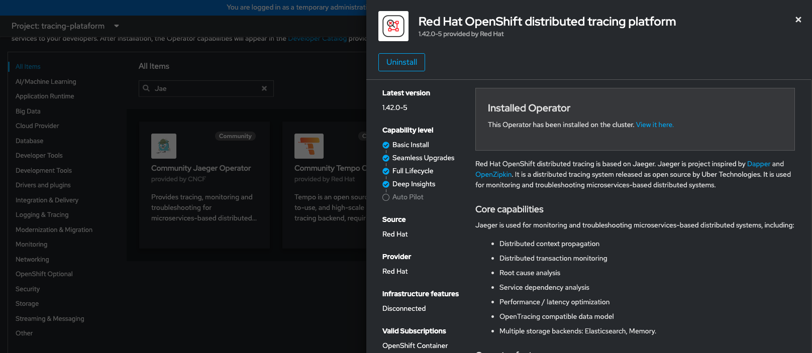

After OpenDistributed Tracing was successfully installed, you can see it on installed operators. Click on it and click in "create instance" like bellow:

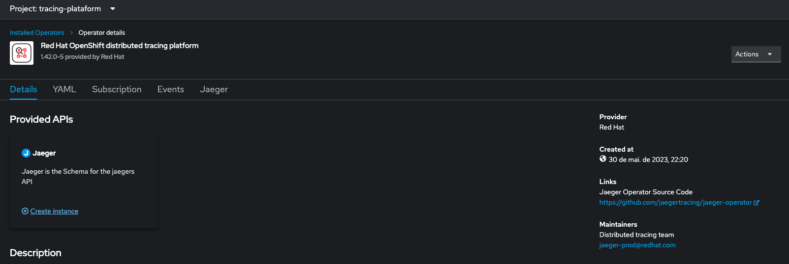

Create a Jaeger Custom Resource with the parameters in file [jaeger-cr.yaml](custom-resources/jaeger/jaeger-cr.yaml) in folder custom-resources/jaeger like bellow:

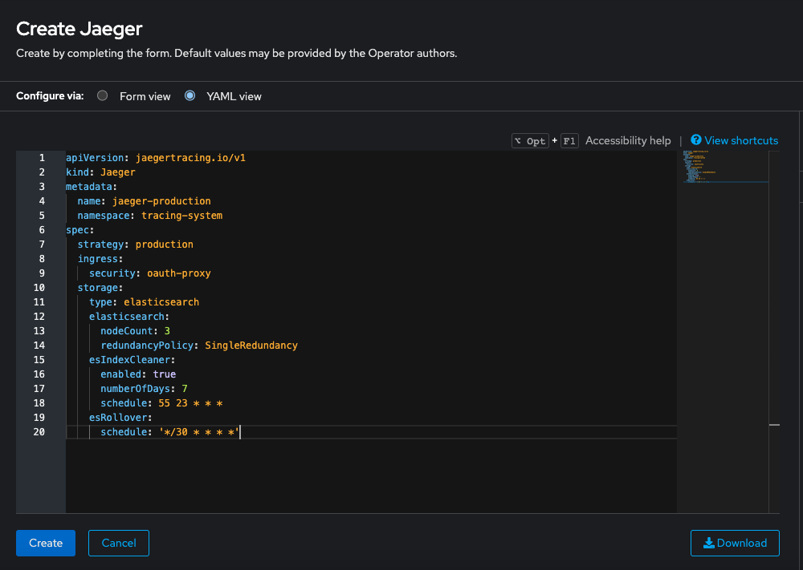

After it's created, you can check if Jaeger is functioning by accessing the route created for it.

## Deploy Kafka Cluster and Kafka Exporter

Now that we have a functional Jaeger, we will deploy our Kafka Cluster with the Kafka Exporter. Change target project to "kafka" project created previously.
In Openshift Operator hub, install AMQ Streams Operator with default configuration like image below:

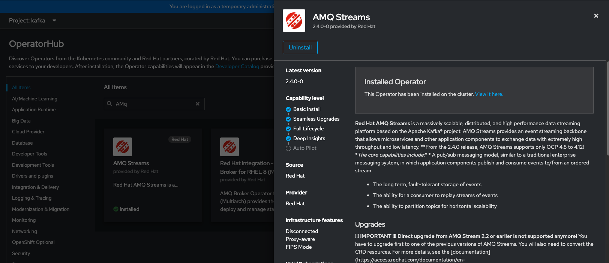

After, we need create a Kafka Cluster with Kafka Exporter Custom Resource, click on Installed Operators, click on AMQ Streams and in Kafka section, click on "Create Instance" 


Change to Yaml view and apply a yaml file like this [kafka-cr.yaml](custom-resources/kafka/kafka-cr.yaml) in folder custom-resources/kafka: 

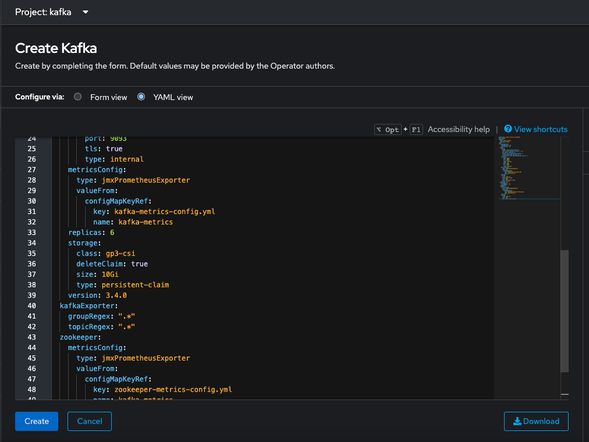

Next, create the Kafka metrics ConfigMap based on the [kafka-metrics-cm.yaml](custom-resources/kafka/kafka-metrics-cm.yaml) file using the following commands:

```bash
cd custom-resources/kafka
oc apply -f kafka-metrics-cm.yaml
```

Now that we have a functional Kafka cluster, let's create the topic for use in our tests. To do this, go back to the 'Installed Operators' section of Openshift and click on the AMQ Streams Operator, then click on the 'Kafka Topic' section and click 'Create Instance'. Apply the YAML as shown below:

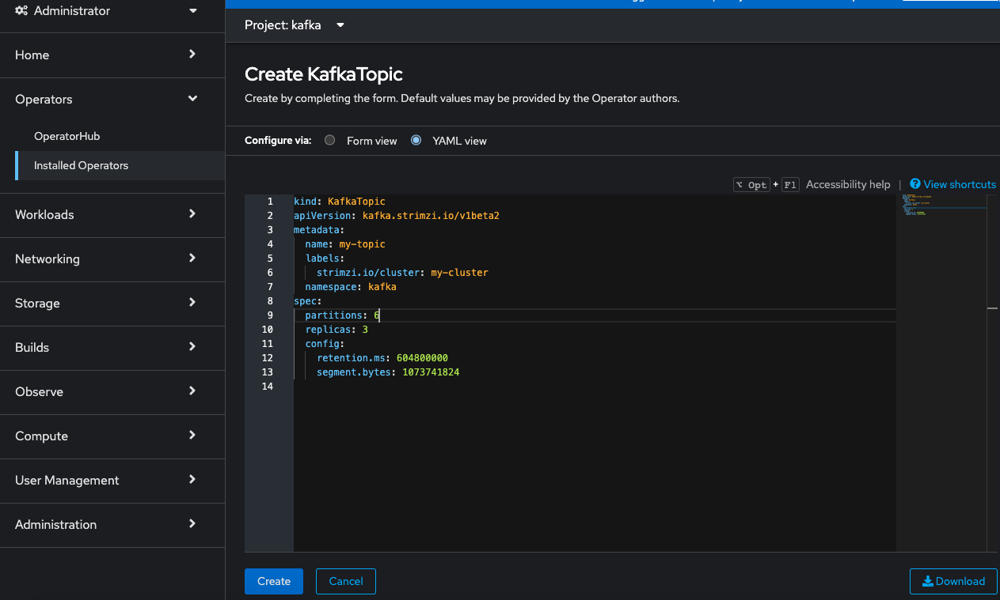

## Deploy Prometheus and Grafana Dashboards

Now we need to install Prometheus to gather metrics from Kafka, and we will create a dashboard in Grafana to help us monitor the resource consumption of the Kafka cluster during load testing.

### Install Prometheus

To install Prometheus, let's go back to the Openshift console and in the Operator Hub section, we will install the Prometheus operator below:

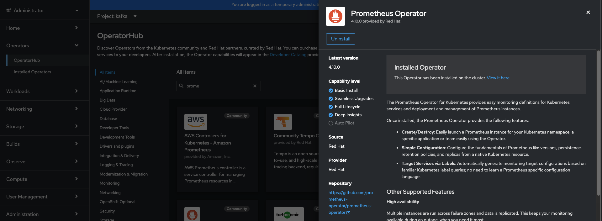

After the operator is installed, we will open a terminal window and navigate to the folder where we mapped this repository, then to the custom resources folder, and finally to the kafka-exporter folder. Log on openshift via command line and we will apply the following commands:

Create a strimzi pod monitor

```bash
oc apply -f strimzi-pod-monitor.yaml
```
Create a rules for prometheus

```bash
oc apply prometheus-rules.yaml 
```
Create additional rules for prometheus

```bash
oc apply - f prometheus-additional.yaml
```
Finally create a prometheus instance

```bash
oc apply -f prometheus.yaml 
```

Wait for the Prometheus pods to be up and running, and we will proceed to the next section.

### Install Grafana and Setup Dashboards

To install Grafana, it's quite simple. We just need to apply the grafana.yaml file located in the custom-resources/grafana directory using the following commands:

```bash
cd custom-resources/grafana
oc apply grafana.yaml 
```
After grafana pods are running you need a create route for grafana service. And log on grafana with user 'admin' and 'admin' password. To setup a datasource, create in config and datasources like bellow:

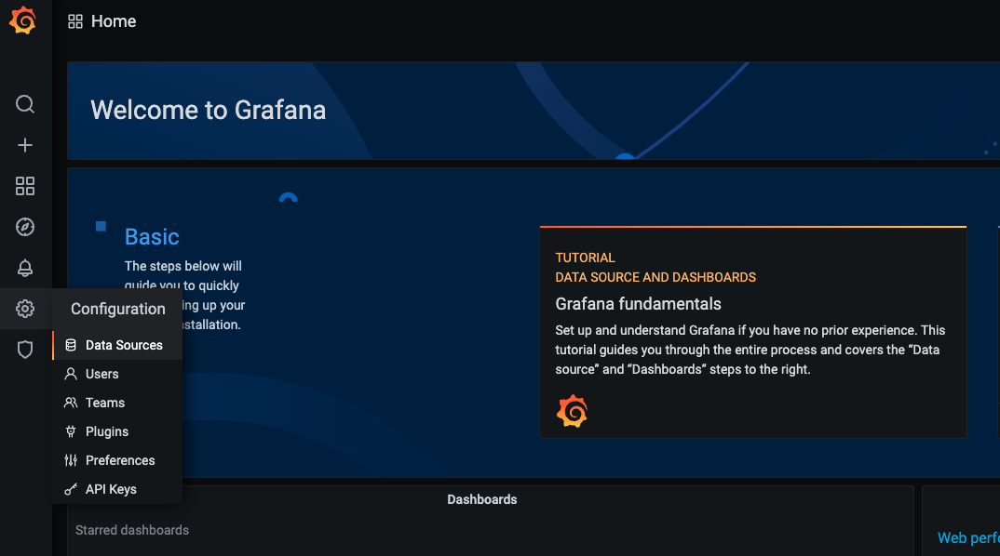

Fill in the fields as shown in the image below and then click on the "Save and Test" button.

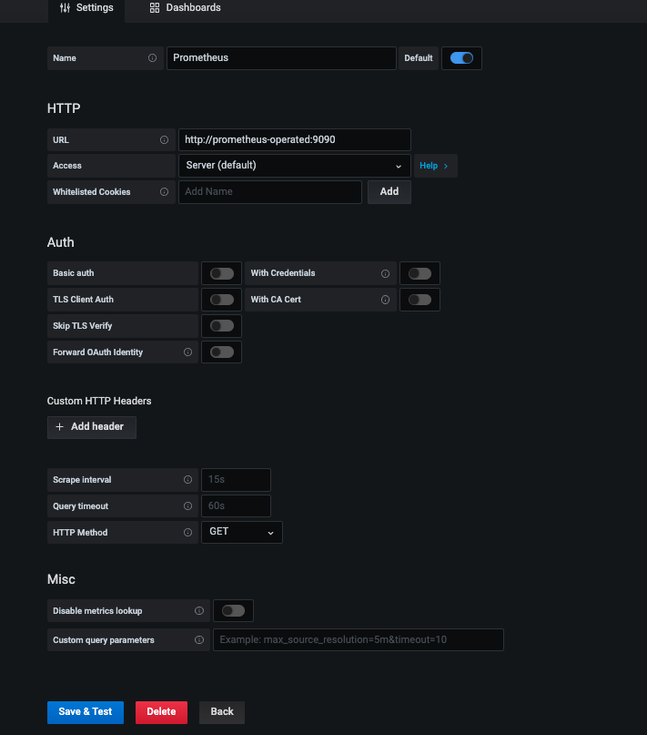

With the datasource configured, we will proceed with the deployment of the dashboard. To do this, click on the plus symbol on the sidebar of Grafana and then click on "Import" as shown below:

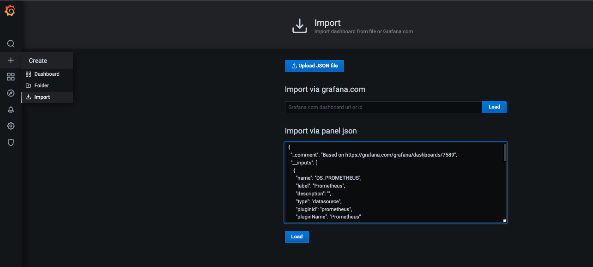

We should copy the content of the file [strimzi-kafka-exporter.json](custom-resources/grafana/strimzi-kafka-exporter.json) into the text area and click on "Import" as shown in the image above. Then, select the previously created datasource and click on "Import" as shown below.


There you have it, the first dashboard is created. If you wish, you can repeat the process for the files [strimzi-kafka.json](custom-resources/grafana/strimzi-kafka.json) and [strimzi-zookeeper.json](custom-resources/grafana/strimzi-zookeeper.json).

## Deploy Camel-Quarkus Apps

Now we will deploy the applications that will consume and produce messages for our load tests. In these applications, I used Camel Quarkus to simplify the implementation. I also used the Quarkus OpenTelemetry exporter OTLP and Quarkus OpenTelemetry components to send metrics to the Jaeger collector. You can check the versions of these components in the pom.xml file of each project. If you need to modify any configuration, you can do so in the application.properties files of the projects or in the environment variables of the deployment that will be created in Openshift in the following steps.
Deploy the producer:

```bash
cd camel-quarkus-kafka-api-producer
./mvnw clean package -Dquarkus.kubernetes.deploy=true
```

Deploy the consumer:

```bash
cd camel-quarkus-kafka-consumer
./mvnw clean package -Dquarkus.kubernetes.deploy=true
```

After deploy applications, note the route to your camel-quarkus kafka producer to pass to Jmeter or K6 in next steps.

## Jmeter tests

JMeter is an open-source performance testing tool developed by Apache. It is widely used for load testing, stress testing, and performance measurement of web applications, APIs, and various server types. JMeter allows users to simulate realistic user scenarios by sending HTTP requests, measuring response times, and analyzing server performance under different loads. It provides a user-friendly interface for creating test plans, configuring test scenarios, and generating detailed reports and graphs for performance analysis. JMeter supports various protocols such as HTTP, HTTPS, FTP, JDBC, SOAP, and many more, making it a versatile tool for performance testing in different domains.You can install jmeter with default config and run it with jmeter.sh file in bin folder.
After open jmeter gui, click on "Open" button and select [Jmeter Test Plan.jmx](jmeter/Jmeter%20Test%20Plan.jmx) file like bellow:

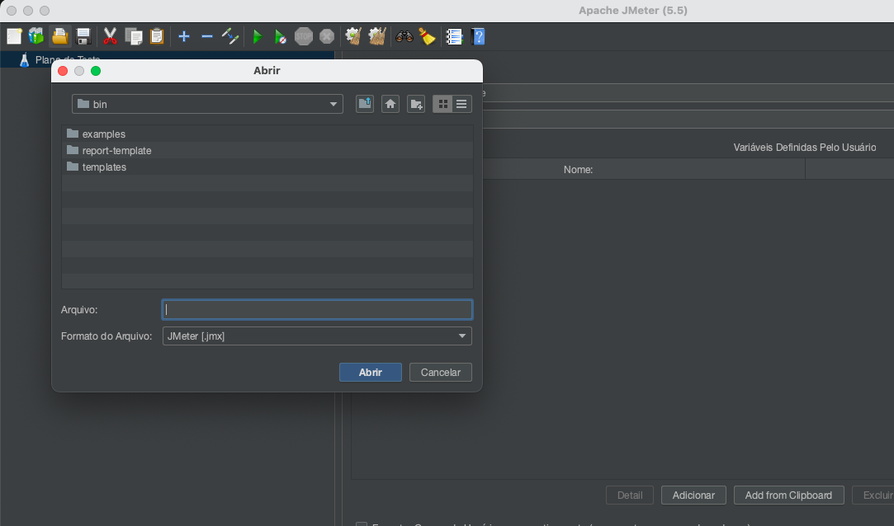

Ajust the user count in User Group session of Test Plan and set the your producer url in API request session in the same Test Plan.

Now click on run button, and check the metrics on grafana and jaeger to make a performance baseline and ajust your environment.

In Grafana metrics, you can view the kafka cluster metrics like messages per second and monitoring consumer lag like bellow:

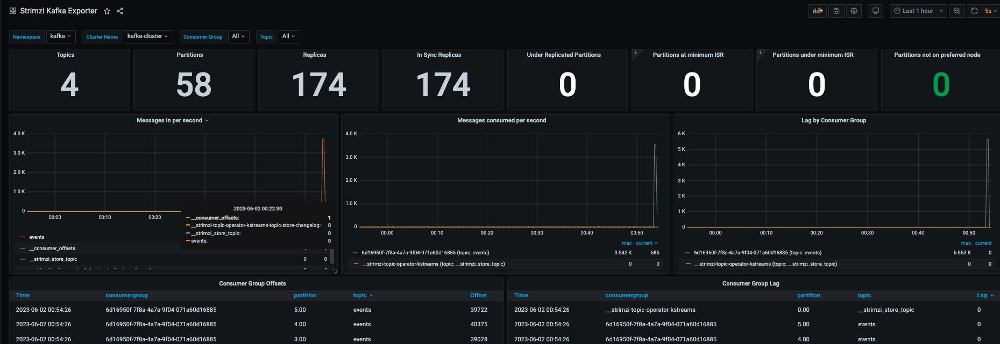

On Jaeger, you can view the tracing and spans of each request and you check the time for produce and consuming messages:

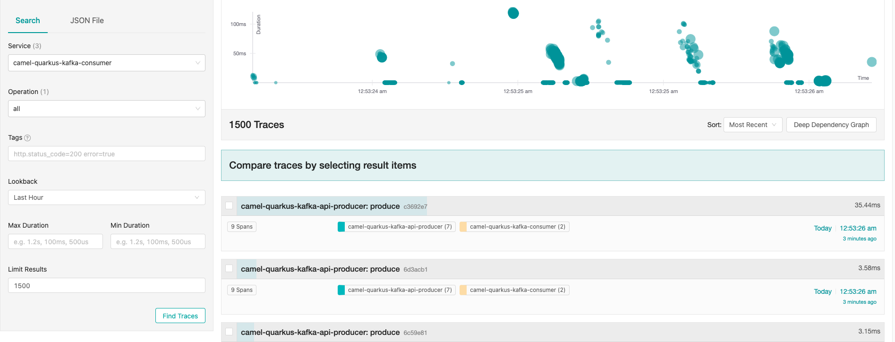

## K6 tests

K6 is an open-source load testing tool designed for developers and focused on simplicity and scalability. It allows you to write and execute load tests using JavaScript, making it easy to define complex scenarios and simulate realistic user behavior. With K6, you can generate high levels of concurrent virtual users to stress test your system and measure its performance under different load conditions. It provides detailed metrics and real-time results, enabling you to identify bottlenecks, measure response times, and assess the scalability and stability of your application. K6's scripting capabilities, extensibility, and integration with other tools make it a popular choice for load testing in agile development and continuous integration workflows.

To run tests using K6 in OCP, do you need install the following programs in your computer:

* Go
* Kustomize
* Kubectl
* Make

After you need clone the K6 Operator repository with this commands:

```bash
git clone https://github.com/grafana/k6-operator && cd k6-operator
```
To deploy K6 Operator, you need run the following command:

```bash
make deploy
```

Now, we back to this repository folder and go create a configmap with our K6 test plan:

```bash
oc project k6-operator-system
cd k6
oc create configmap k6-api-test --from-file kafka-load-tests.js
```

Finally, we do create a k6 instance with this command:

```bash
oc apply -f k6-sample.yaml
```
You can follow the Test run with command "oc get pods" and observe, in this case 4 pods simultaneously running tests like bellow:


Ajusts the test case for what your need and enjoy!

## Conclusions

Despite using simpler approaches and spending a lot of time deploying metrics tools for load testing, this approach allows us to tune our environment as we execute the tests. We can adjust the number of users to a scenario that truly makes sense for the application, thus obtaining more accuracy in tuning the environment.

## References

[Open Telemetry Deployment Documentation](https://docs.openshift.com/container-platform/4.12/distr_tracing/distr_tracing_install/distr-tracing-deploying-otel.html)

[Red Hat AMQ Streams Deployment Documentation](https://access.redhat.com/documentation/pt-br/red_hat_amq/7.7/html-single/deploying_and_upgrading_amq_streams_on_openshift/index#deploy-tasks_str)

[Red Hat AMQ Streams Assembly Metrics](https://access.redhat.com/documentation/pt-br/red_hat_amq/7.7/html-single/deploying_and_upgrading_amq_streams_on_openshift/index#assembly-metrics-str)

[JMeter Get Started Guide](https://jmeter.apache.org/usermanual/get-started.html)

[Running Distributed Tests on Kubernetes with K6](https://k6.io/blog/running-distributed-tests-on-k8s/)

